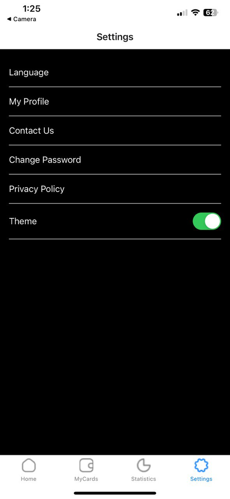

# My App

MyApp is a React Native application built with Expo. The application provides a seamless user experience with both light and dark themes. This app includes several screens such as Home, My Cards, Statistics, and Settings, where users can switch between themes and manage their preferences.

Getting Started
These instructions will get you a copy of the project up and running on your local machine for development and testing purposes.

Prerequisites
Make sure you have Node.js and npm installed on your system. You will also need Expo CLI installed globally.

To install Expo CLI globally, use the command:
npm install -g expo-cli

Installing
Clone the repository

Clone the repository using the command:
git clone <https://github.com/yourusername/MyApp.git>
Navigate into the project directory:
cd MyApp

Install dependencies

Install the project dependencies using the command:
npm install

Start the project

Start the project using the command:
npm start

Project Screens
Home Screen
The Home Screen includes a welcome message, a search icon, and a list of recent transactions. Users can see their card details and navigate through different options like Sent, Receive, Loan, and Topup.

Settings Screen
The Settings Screen allows users to manage their preferences including changing the password, viewing the privacy policy, toggling between light and dark themes, changing the language, and contacting support.

Theme Toggle
The theme toggle feature allows users to switch between light and dark themes. The current theme is persisted across the application and can be changed from the Settings screen.

Custom Components
The application uses custom components throughout, including Card and TransactionItem components, to ensure a consistent look and feel.

Navigation
The app uses React Navigation for handling navigation between screens. The main navigation structure is defined in AppNavigator.js.

Running the Project
To run the project on your local machine, use the Expo CLI:

Make sure you are in the project directory:
cd MyApp

Start the project:
npm start

This will start the Expo development server and provide you with options to run the app on an emulator, a connected device, or in a web browser.

Built With
React Native - A framework for building native apps using React.
Expo - A platform for making universal native apps for Android, iOS, and the web with JavaScript and React.
React Navigation - Routing and navigation for your React Native apps.
Authors
Your Name - Student - bonyaah Abdul-Razak

Screenshots
[Alt text](assets/screen1.jpg) 
Acknowledgments
Hat tip to anyone whose code was used
Inspiration
etc.
